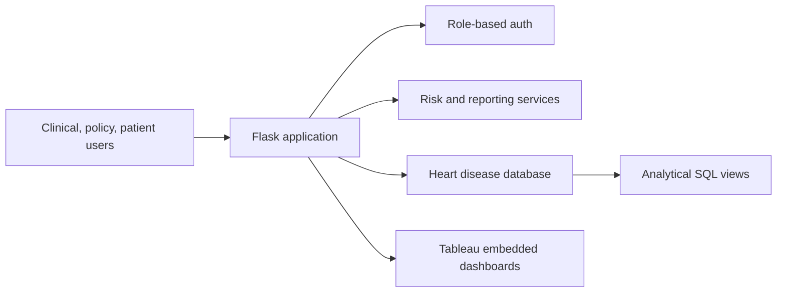

# DataVibe Project Documentation

## Architecture

DataVibe uses a Flask web layer, a service layer for analytics and reporting, and a relational schema that can run locally in SQLite or be migrated to PostgreSQL. Tableau dashboards are embedded through configurable workbook URLs.

## Personas

- Dr. Sharma: high-risk patient review, clinical indicators, patient search.
- Ramesh: regional prevalence, lifestyle risk summaries, policy reporting.
- Anita: personal risk score, health indicators, lifestyle recommendations.

## Data Privacy Notes

The demo stores synthetic data only. A production implementation should add field-level encryption, consent tracking, audit log persistence for every sensitive read, HTTPS-only cookies, 2FA, and formal HIPAA or local healthcare compliance review.

## Deployment

Use Docker Compose for local container runs. For production, move secrets to the cloud secret manager, configure PostgreSQL, place the app behind TLS, and connect Tableau Server or Tableau Cloud with SSO.

## Interactive Data Visualizations

The platform features 10 unique, interactive data visualizations accessible to Public Health Officers under the **Interactive Charts** tab, as well as 10 corresponding Tableau-ready MySQL views under `scripts/mysql_schema.sql` for easy dashboard integration.

### Visualization Catalogue

1. **Gender vs Heart Disease**: Comparative bar chart showing heart disease prevalence by sex.
   - *MySQL View*: `view_viz_gender_heart_disease`
2. **Age vs Heart Disease**: Line chart tracking heart disease rates across different age cohorts.
   - *MySQL View*: `view_viz_age_heart_disease`
3. **Diabetic vs Stroke**: Comparative bar chart showing stroke prevalence by diabetic status.
   - *MySQL View*: `view_viz_diabetic_stroke`
4. **Smoking & Alcohol vs Heart Disease**: Grouped bar chart showing heart disease rates for combinations of tobacco and alcohol use (Neither, Alcohol Only, Smoking Only, Both).
   - *MySQL View*: `view_viz_smoking_alcohol_heart`
5. **Other Diseases vs Stroke**: Comparative bar chart evaluating stroke rates in patients with other comorbidities (Asthma, Kidney Disease, Skin Cancer).
   - *MySQL View*: `view_viz_other_diseases_stroke`
6. **Race-wise Heart Disease**: Horizontal bar chart identifying heart disease rate across racial/ethnic groups.
   - *MySQL View*: `view_viz_race_heart_disease`
7. **General Health vs Heart Disease**: Comparative bar chart showing how self-reported health rating correlates with heart disease rates.
   - *MySQL View*: `view_viz_gen_health_heart`
8. **Physical Activity vs Heart Disease**: Bar chart showing disease rates for active vs. inactive cohorts.
   - *MySQL View*: `view_viz_activity_heart_disease`
9. **Age & BMI vs Diabetic**: Interactive scatter plot mapping patient age midpoint vs. BMI, color-coded by diabetic status to show risk clusters.
   - *MySQL View*: `view_viz_age_bmi_diabetic`
10. **Stroke Cohort Overlap**: Stacked bar chart showing stroke prevalence in cohorts of patients suffering from heart disease, diabetes, both, or neither.
    - *MySQL View*: `view_viz_stroke_heart_diabetic_overlap`
